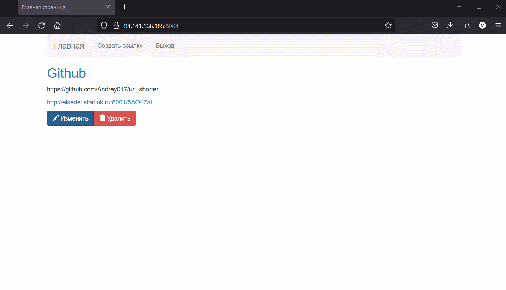
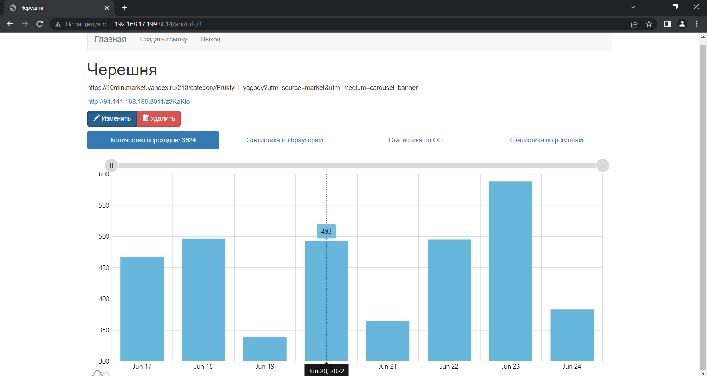
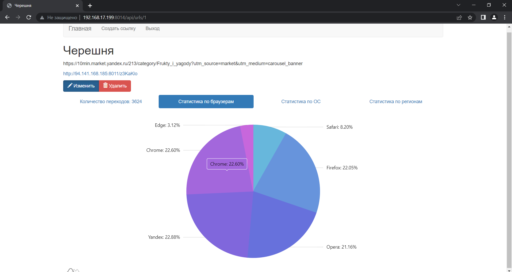
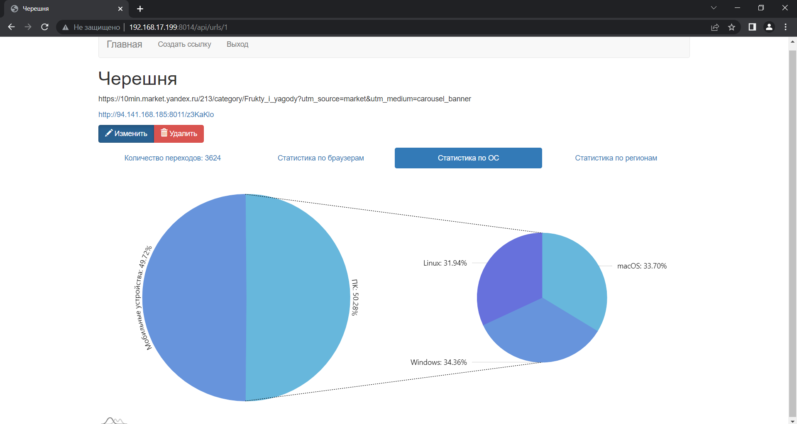
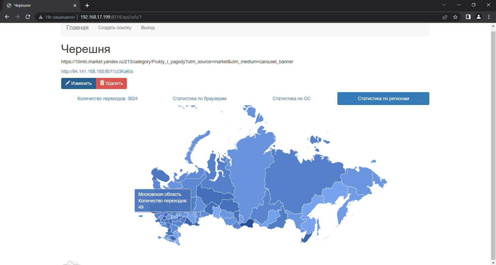

# URL-Shorter

Программный комплекс представляет из себя сервис сокращения унифицированного указателя ресурса, ориентированный на работу с маркетологами для помощи в маркетинговом продвижении товара.

Сервис доступен пользователям в виде веб-сайта и дает возможность пользователям регистрироваться, создавать собственные сокращенные унифицированные указатели ресурса и отслеживать статистику переходов по этим указателям.

## Демонстрация работы сервиса

### 1. Создание, редактирование ссылки и переход по ссылке

  

### 2. Диаграмма статистики количества переходов по дням

  

### 3. Диаграмма статистики количества переходов по типам браузера

  

### 4. Диаграмма статистики количества переходов по типам устройств

  

### 5. Диаграмма статистики количества переходов по регионам России

  

## Стек используемых технологий

- Go
- Visual Studio Code
- Gin
- amCharts
- Web API
